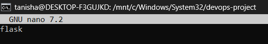
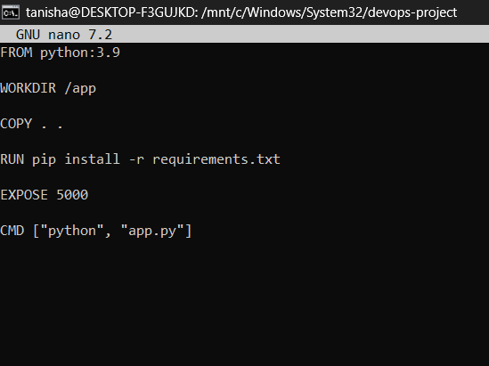

Assignment 1 
---

# Containerized Web Application with PostgreSQL using Docker Compose and IPvlan

---

**Name:** Tanisha Thakur
**Batch:** B3
**SAP ID:** 500120261

---
| Resource | Link |
| --- | --- |
| 🌐 Live Project Page | [Open Site](https://tanisha0895.github.io/Containerization_and_DevOps_Lab/Assignment%201/intro.html) |

---

## Project Overview

This project demonstrates how to design, containerize, and deploy a web application using Docker.

The application consists of:

- **Backend API:** Python + Flask
- **Database:** PostgreSQL 15
- **Orchestration:** Docker Compose
- **Networking:** Docker IPvlan
- **Storage:** Docker Named Volume

---

## 1. Introduction

Docker is a containerization platform that allows developers to package applications and their dependencies into portable containers. Docker Compose simplifies the orchestration of multi-container applications.

This project implements a containerized web application using:

- **Python + Flask** as the backend API
- **PostgreSQL** as the relational database
- **Docker Compose** for container orchestration
- **IPvlan networking** for static IP assignment to containers
- **Named volumes** for persistent database storage

---

## 2. System Architecture

The application follows a two-tier architecture:

- **Backend Layer**: Python Flask REST API serving web pages and JSON responses
- **Database Layer**: PostgreSQL database for persistent data storage

### Architecture Diagram

```
Client (Browser)
        |
        | HTTP Request (Port 5000)
        v
+-------------------------------+
|  Backend Container            |
|  Python + Flask               |
|  IP Address: 192.168.170.10   |
|  Port: 5000                   |
+-------------------------------+
        |
        | PostgreSQL Connection (Port 5432)
        v
+-------------------------------+
|  Database Container           |
|  PostgreSQL 15                |
|  IP Address: 192.168.170.11   |
|  Port: 5432                   |
+-------------------------------+
        |
        v
+-------------------------------+
|  Docker Named Volume          |
|  pgdata                       |
|  /var/lib/postgresql/data     |
+-------------------------------+
```

---

## 3. Repository Structure

```
devops-project/
│
├── backend/
│   ├── main.py              ← Flask server (routes and API)
│   ├── Dockerfile           ← Backend Docker image
│   ├── requirements.txt     ← Python dependencies
│   └── templates/
│       └── index.html       ← Web UI served by Flask
│
├── database/
│   ├── Dockerfile           ← Custom PostgreSQL image
│   └── init.sql             ← Auto-creates users table
│
└── docker-compose.yml       ← Orchestrates all containers
```

---

## 4. Application Endpoints

| Endpoint | Method | Description |
|----------|--------|-------------|
| `/` | GET | Serves the main web page |
| `/api` | GET | Returns backend status as JSON |

### Example API Response

```json
{
  "message": "DevOps Project 🚀",
  "status": "Backend running successfully"
}
```

---

## 5. Source Code

### backend/main.py

```python
from flask import Flask, render_template

app = Flask(__name__)

@app.route('/')
def home():
    return render_template("index.html")

@app.route('/api')
def api():
    return {
        "message": "DevOps Project 🚀",
        "status": "Backend running successfully"
    }

if __name__ == '__main__':
    app.run(host='0.0.0.0', port=5000)
```


---

### backend/requirements.txt

```
flask
```



---

### backend/Dockerfile

```dockerfile
FROM python:3.9

WORKDIR /app

COPY . .

RUN pip install -r requirements.txt

EXPOSE 5000

CMD ["python", "main.py"]
```



---

### backend/templates/index.html

The web UI served by Flask at `http://localhost:5000`


---

### database/Dockerfile

```dockerfile
FROM postgres:15-alpine

ENV POSTGRES_DB=mydb
ENV POSTGRES_USER=myuser
ENV POSTGRES_PASSWORD=mypassword

COPY init.sql /docker-entrypoint-initdb.d/

EXPOSE 5432
```


---

### database/init.sql

```sql
CREATE TABLE IF NOT EXISTS users(
  id SERIAL PRIMARY KEY,
  name TEXT
);
```


---

### docker-compose.yml

```yaml
version: "3.9"

services:

  backend:
    build: ./backend
    container_name: pa1_backend
    ports:
      - "5000:5000"
    environment:
      DB_HOST: db
      POSTGRES_USER: myuser
      POSTGRES_PASSWORD: mypassword
      POSTGRES_DB: mydb
    depends_on:
      - db
    networks:
      ipvlan_net:
        ipv4_address: 192.168.170.10

  db:
    image: postgres:15-alpine
    container_name: pa1_db
    environment:
      POSTGRES_USER: myuser
      POSTGRES_PASSWORD: mypassword
      POSTGRES_DB: mydb
    volumes:
      - pgdata:/var/lib/postgresql/data
      - ./database/init.sql:/docker-entrypoint-initdb.d/init.sql
    networks:
      ipvlan_net:
        ipv4_address: 192.168.170.11

networks:
  ipvlan_net:
    external: true

volumes:
  pgdata:
```


---

## 6. Container Networking

IPvlan networking is used to assign static IP addresses to containers. IPvlan allows containers to share the host's MAC address while having their own unique IP addresses on the network.

### Network Creation Command

```bash
docker network create \
  -d ipvlan \
  --subnet=192.168.160.0/20 \
  --gateway=192.168.160.1 \
  -o ipvlan_mode=l2 \
  -o parent=eth0 \
  ipvlan_net
```

### Assigned Container IPs

| Container | IP Address | Port |
|-----------|-----------|------|
| pa1_backend | 192.168.170.10 | 5000 |
| pa1_db | 192.168.170.11 | 5432 |

---

## 7. IPvlan vs Macvlan Comparison

| Feature | IPvlan | Macvlan |
|---------|--------|---------|
| Network Layer | Layer 3 (IP) | Layer 2 (Ethernet) |
| MAC Address | Shared host MAC | Unique MAC per container |
| Host Communication | Host can communicate | Host cannot directly access |
| Use Case | Cloud and virtualized environments | Simulating physical devices |

**Why IPvlan was chosen:**
- Works well with WSL2 and virtualized environments
- Host can communicate with containers
- Suitable for cloud-based deployments

---

## 8. Build and Run

### Step 1 — Create Project Directory

```bash
mkdir devops-project
cd devops-project
```

### Step 2 — Create IPvlan Network

```bash
docker network create \
  -d ipvlan \
  --subnet=192.168.160.0/20 \
  --gateway=192.168.160.1 \
  -o ipvlan_mode=l2 \
  -o parent=eth0 \
  ipvlan_net
```

### Step 3 — Build and Start Containers

```bash
docker compose up --build -d
```

### Step 4 — Verify Running Containers

```bash
docker ps
```


---

## 9. Application Output

Web application running at `http://localhost:5000`:


### Flask Server Running


---

## 10. Verification

### Verify Docker Images

```bash
docker images
```


---

### Verify Network

```bash
docker network inspect ipvlan_net
```


---

### Verify Volumes

```bash
docker volume ls
```


---

## 11. Volume Persistence Test

The named volume `pgdata` ensures PostgreSQL data persists even after containers are stopped or restarted.

| Benefit | Description |
|---------|-------------|
| Data Survival | Data persists even if containers are stopped or removed |
| Easy Backup | Volume can be backed up independently |
| Isolation | Completely isolated from the container filesystem |

```bash
# Stop containers (volume is NOT deleted)
docker compose down

# Confirm volume still exists
docker volume ls | grep pgdata

# Restart containers
docker compose up -d

# Volume and data still present!
docker volume ls
```


---

## 12. Notes on WSL2 + IPvlan

In WSL2, containers on an IPvlan network cannot be reached directly from the Windows host due to Hyper-V virtual switch NAT isolation. All testing is done from inside the container using `docker exec`. This is a known limitation.

---

## 13. Conclusion

By using Docker Compose and IPvlan networking, the Flask backend and PostgreSQL database are deployed as independent containers with static IP addresses. The named volume `pgdata` ensures that database data remains intact across container restarts, demonstrating persistent storage in a containerized environment.
